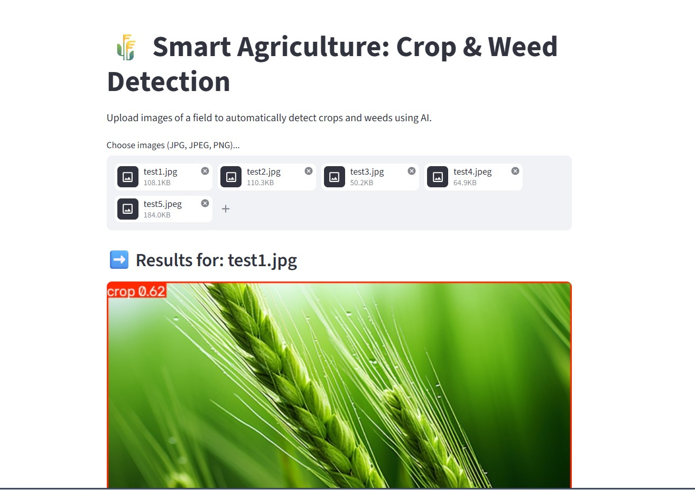
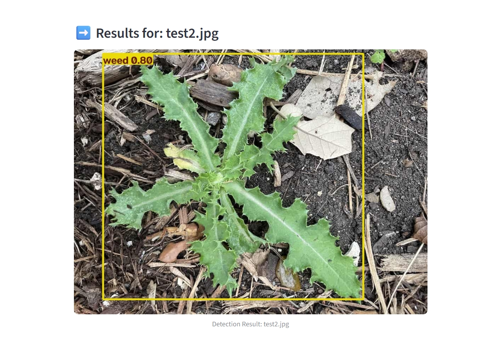

# 🌾 Smart Agriculture: Crop and Weed Detection

A modern, AI-powered computer vision web application built to automatically detect and differentiate between crops and weeds in agricultural fields using Deep Learning (YOLOv8).

## 🎯 Objective

This project serves as an AI solution to tackle a real-world agricultural problem: Pesticide Wastage. By precisely identifying weeds, this system can be integrated into smart farming equipment to ensure pesticides are only sprayed where necessary, saving costs and protecting the environment.

## 📸 Preview

### Application Interface & Detection

### Real-world Edge Cases (Domain Shift)

## ✨ Features

* Clean and interactive Streamlit web interface.
* State-of-the-art Object Detection using YOLOv8.
* Support for multiple image uploads simultaneously.
* Real-time bounding box generation with confidence scores.
* Analyzes industrial edge-cases like texture bias and domain shift.
* Lightweight processing with OpenCV.

## 🛠️ Technologies Used

### Machine Learning & Computer Vision

* Python
* YOLOv8 (Ultralytics)
* OpenCV

### Frontend / Web Interface

* Streamlit

### Development Tools

* Git & GitHub
* VS Code

## 📂 Project Structure

    CROP-WEED-DETECTION/
    ├── sample_images/
    ├── best.pt
    ├── Crop_Weed_Detection_Meghram_USC_UCT.pdf
    ├── CropWeedDetection.py
    ├── Preview1.jpg
    ├── Preview2.jpeg
    ├── README.md
    └── requirements.txt

## 🚀 How to Run Locally

### 1️⃣ Clone the Repository

    git clone https://github.com/meghramb/upskillcampus.git

### 2️⃣ Navigate to the Project Folder

    cd upskillcampus

### 3️⃣ Install Dependencies

    pip install -r requirements.txt

### 4️⃣ Start the Web Application

    python -m streamlit run CropWeedDetection.py

### 5️⃣ Open in Browser

Visit:

    http://localhost:8501

## 👨‍💻 About Me

Hi, I'm **Meghram Bairwa**.

🎓 MCA Student at Central University of Haryana

💻 Aspiring Full-Stack Developer

🤖 Machine Learning & AI Enthusiast

🔗 Blockchain Enthusiast

🚀 Passionate about building innovative digital solutions using modern web technologies and AI.

## 📬 Connect With Me

### GitHub

https://github.com/meghramb

### LinkedIn

https://www.linkedin.com/in/meghrambairwa/

### Email

meghramb594@gmail.com

## ⭐ Support

If you like this project, please consider giving it a ⭐ on GitHub.

Your support motivates me to build more exciting projects and contribute to the developer community.