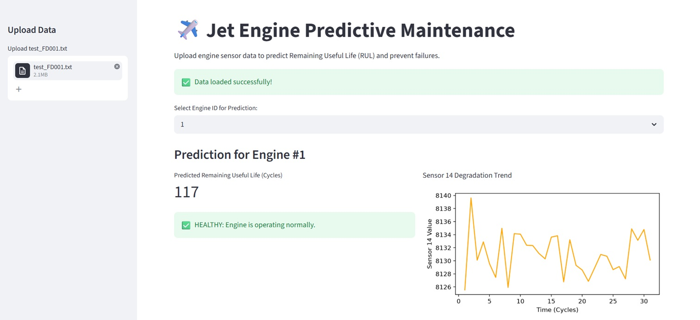
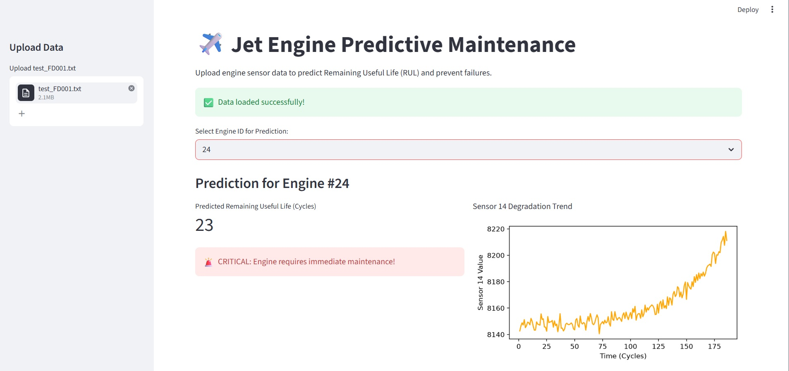

# ✈️ Industrial AI: Predictive Maintenance of Turbofan Engines

A modern, machine learning-powered web application built to predict the Remaining Useful Life (RUL) of turbofan engines using complex sensor data and advanced regression techniques (XGBoost).

## 🎯 Objective

This project tackles a massive industrial and aviation problem: Unplanned downtime and catastrophic machine failures. By analyzing real-time sensor data to accurately predict exactly when an engine will fail (RUL), airlines and factories can schedule maintenance proactively. This prevents accidents, reduces maintenance costs, and saves millions of dollars.

## 📸 Preview

### RUL Prediction Dashboard
 

### Sensor Data Analysis 

*(Note: Don't forget to add your Streamlit app screenshots in the folder and name them Preview1.jpg and Preview2.jpg)*

## ✨ Features

* Clean and interactive Streamlit web interface.
* State-of-the-art predictive regression modeling using XGBoost.
* End-to-end pipeline: from sensor data preprocessing to real-time inference.
* Handles complex, multidimensional aircraft engine sensor data (21 distinct sensors).
* Translates raw data into actionable business insights (Remaining Useful Life).
* Built for real-world industrial and aviation applications.

## 🛠️ Technologies Used

### Machine Learning & Data Science

* Python
* Scikit-Learn & XGBoost
* Pandas & NumPy

### Frontend / Web Interface

* Streamlit

### Development Tools

* Git & GitHub
* VS Code

## 📂 Project Structure

    Turbofan_Predictive_Maintenance/
    ├── test_FD001.txt
    ├── train_FD001.txt
    ├── train_local.py
    ├── turbofan_xgb_model.pkl
    ├── PredictiveMaintenance_Meghram_USC_UCT.pdf
    ├── TurbofanPredictiveMaintenance.py
    ├── Preview1.jpg
    ├── Preview2.jpg
    ├── README.md
    └── requirements.txt

## 🚀 How to Run Locally

### 1️⃣ Clone the Repository

    git clone https://github.com/meghramb/upskillcampus.git

### 2️⃣ Navigate to the Project Folder

    cd upskillcampus/Turbofan_Predictive_Maintenance

### 3️⃣ Install Dependencies

    pip install -r requirements.txt

### 4️⃣ Start the Web Application

    python -m streamlit run TurbofanPredictiveMaintenance.py

### 5️⃣ Open in Browser

Visit:

    http://localhost:8501

## 👨‍💻 About Me

Hi, I'm **Meghram Bairwa**.

🎓 MCA Student at Central University of Haryana

💻 Aspiring Full-Stack Developer

🤖 Machine Learning & AI Enthusiast

🔗 Blockchain Enthusiast

🚀 Passionate about building innovative digital solutions using modern web technologies and AI.

## 📬 Connect With Me

### GitHub

https://github.com/meghramb

### LinkedIn

https://www.linkedin.com/in/meghrambairwa/

### Email

meghramb594@gmail.com

## ⭐ Support

If you like this project, please consider giving it a ⭐ on GitHub.

Your support motivates me to build more exciting projects and contribute to the developer community.